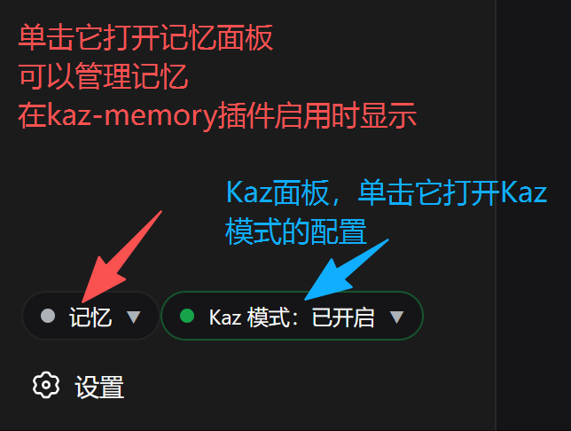
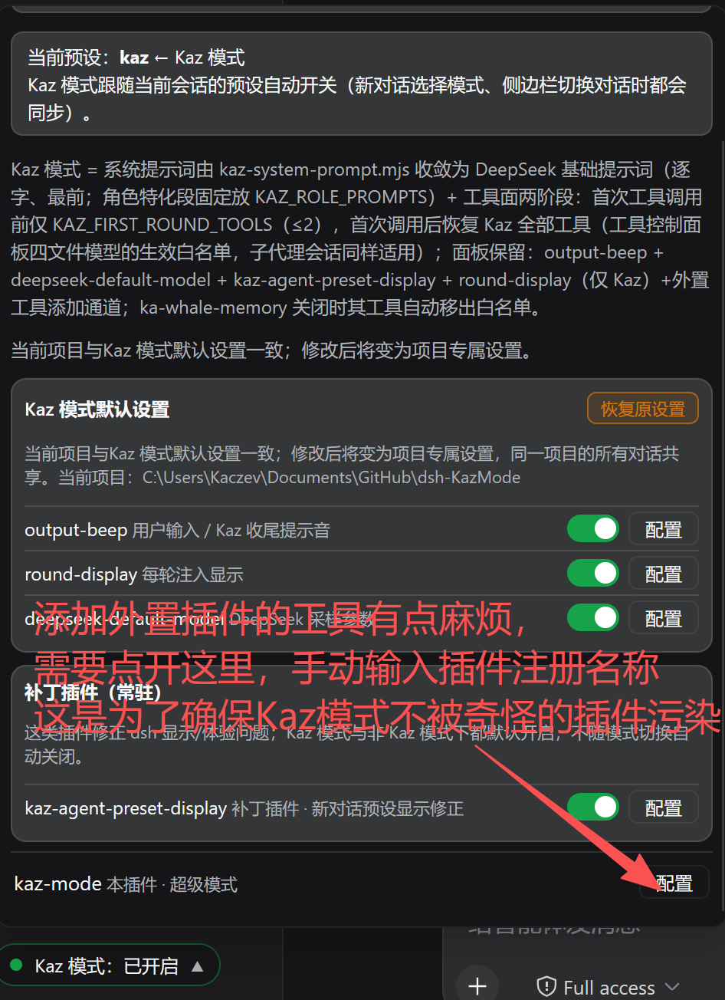

# Kaz 模式（dsh-KazMode 全家桶）

> 为 DeepSeek Harness（dsh）设计的一套工作模式与插件合集：**极简提示词 + 两阶段工具面 + 跨会话记忆**，用于提升模型的推理效率与输出质量。
> 没有安排多subagent，因为我现在用不起，没法测试效果。所以该模式只有一个agent。

## 一、核心特性

- **跨会话记忆**：模型会把经验存为明文记忆，同一话题下越用越好用。以往每次重开新对话，要么重新向模型说明项目，要么模型每次都需要自己重新探索项目，有了kaz-memory插件，模型可以从记忆中搜索，快速找到方向；
- **(研发中，未经测验)agent自优化**：记忆系统并非单纯的记忆，而是会总结成经验，具有类似于skill的特性。agent会管理记忆，及时清除无用记忆，优化已有记忆。
- **提示词极简**：Kaz 会话的系统提示词由 `kaz/kaz-system-prompt.mjs` 按条件控制，默认是极简模式的 `You are a helpful software engineer assistant.`，`kaz-memory` 启用时切换为记忆优先提示词，保障deepseek-v4的性能；
- **工具面两阶段**：首次工具调用前按 kaz-memory 自动暴露（开=`memory_search`；关=`pwsh`+`read`+`edit`），第一次工具调用后恢复白名单里的全部工具；
- **根据任务适配模式**：会根据任务类别，自动启用Plan、Goal模式适配任务。
- **配置按对话隔离**：每个对话、每种模式（Kaz / 非 Kaz）都有独立的插件开关与参数，在 **Kaz 面板**里调整，互不干扰；
- **功能按插件分离**：Kaz模式的功能是按插件分离的。如果仅想要Kaz模式的部分功能，也可以在 **Kaz面板** 里面单独开启；
- **工具精选**：Kaz模式下，默认的工具很少。如果安装了其它插件，需要额外添加工具，则在面板中的白名单里面加入工具名称即可。（不推荐加很多，尽可能少吧）

- **注意，如果要用/plan和/goal，需要在工具面板开启对应的工具，默认不开启，这是为了提高效率。**
- **推荐思考强度在high及以上**，low容易使用let me思维链。

---

## 二、快速开始

本仓库保存 **Kaz 模式全家桶**：Kaczev 在 dsh（DeepSeek Harness）里使用的全部插件和 `kaz` 预设；这是仓库说明，写给 DeepSeek 的安装步骤已拆到专用指引文件。

> 安装时最需要注意两件事：
> 1. **插件必须装到 `KazPlugins` 文件夹**（不是 `plugins`）；
> 2. **预设必须装成 `.agent-presets/kaz`**（小写 `kaz`，文件直接放在该目录根部）。

> **给 DeepSeek 用（ds 安装法）**：安装 / 更新时让 DeepSeek 直接读专用指引，不要让它读本 README：
> - 全新安装 → `ds安装指引.md`（提示词见 `ds安装法的提示词.txt`）
> - 旧版更新 → `ds更新指引.md`（提示词见 `ds更新法的提示词.txt`）

> 写安装程序老是出错，我决定使用最先进的 ds 安装法，根本无需考虑那么多（推荐在梁文谷的时候安装）

### 2.1 安装前提

- 已安装 dsh，并存在 `~/.dsh/profiles/web`（`$env:USERPROFILE\.dsh\profiles\web`）。
- 本说明以 Windows + PowerShell 为例；DeepSeek 在安装时请按实际环境调整。
- 若目标机就是当前机器，源路径是：
  - 插件源：`存仓库的文件夹\dsh-KazMode\KazPlugins`
  - 预设源：`存仓库的文件夹\dsh-KazMode\kaz`

### 2.2 三条铁律（先读）

1. **插件目录名必须是 `KazPlugins`**。  
   目标位置：`%USERPROFILE%\.dsh\profiles\web\KazPlugins`  
   不要把 Kaz 插件复制进 `%USERPROFILE%\.dsh\profiles\web\plugins`。

2. **预设目录名必须是 `kaz`（小写）**。  
   目标位置：`%USERPROFILE%\.dsh\.agent-presets\kaz`  
   不要把预设装成 `Kaz`，也不要从 `KazPlugins\kaz-mode\kaz-preset` 安装预设。

3. **`agent.cordis.yml` 和 `preset.yml` 必须直接位于 `.agent-presets\kaz\` 根部**。  
   dsh 的预设发现规则不递归扫描，嵌套会装不上。

### 2.3 安装 / 更新步骤一览

| # | 做什么 | 详见 |
| --- | --- | --- |
| 1 | 复制插件 `KazPlugins` 与预设 `kaz` | `ds安装指引.md` 第 2–3 步 |
| 2 | 在 `profiles/web/package.json` 注册依赖（`kaz-shared` 必需） | `ds安装指引.md` 第 4 步 |
| 3 | `npm install` 安装依赖 / 建立 junction | `ds安装指引.md` 第 5 步 |
| 4 | 编辑 `profiles/web/cordis.patch.yml` | `ds安装指引.md` 第 6 步 |
| 5 | `settings.yaml` 无需修改（纯方案 A） | `ds安装指引.md` 第 7 步 |
| 6 | 重启 dsh web + 强刷 + 选 Kaz 预设 | `ds安装指引.md` 第 8–9 步 |

> 完整命令、完整 JSON / YAML、出错处理都在 `ds安装指引.md` / `ds更新指引.md` 里，README 不再重复维护，避免两处漂移。

---

## 三、配置（Kaz 面板）

- **功能按插件分离**：Kaz 面板可单独开启 / 关闭每个插件。不喜欢某个插件？在 Kaz 面板直接关掉；还能把当前状态“设为 Kaz / 非 Kaz 模式的默认设置”，非常灵活。
- **配置按对话隔离**：每个对话、每种模式（Kaz / 非 Kaz）都有独立的插件开关与参数，在 **Kaz 面板**里调整，互不干扰。
- **工具白名单**：Kaz 模式下默认工具很少；若安装了其它插件需额外添加工具，在面板白名单里加入工具名称即可（不推荐加很多，尽可能少）。
- **面板「本地版本」**：读的是 `KazPlugins/kaz-mode/package.json` 里的 `version` 字段，发版逻辑见「八、文件与版本说明」。

### 3.1 面板在哪打开

三个常用面板的入口位置（截图来自 dsh web 浏览器界面）：

**记忆面板与 Kaz 面板**：记忆面板是 kaz-memory 的待确认记忆 / 记忆管理界面（人工确认 `memory_save` 等保存的内容）；Kaz 面板集中管理被管理插件的开关，并可把当前状态设为 Kaz / 非 Kaz 模式的默认。



**工具面板（工具控制面板）**：管理工具白名单（哪些工具进入 Kaz 工具面），按项目隔离。



---

## 四、仓库内容

仓库根目录已经包含全家桶的主要源文件夹（另有两个可选工具/预设目录）：

```
dsh-KazMode/
├── KazPlugins/                     # 插件全家桶（12 个插件 + kaz-shared 依赖包）
│   ├── create-plan/
│   ├── deepseek-default-model/
│   ├── first-round-hints/
│   ├── ka-whale-workflow/
│   ├── kaz-agent-preset-display/
│   ├── kaz-memory/
│   ├── kaz-mode/
│   ├── kaz-shared/                  # 依赖包（非插件）：Kaz 工具清单单一事实源
│   ├── output-beep/
│   ├── plugin-filter/
│   ├── round-display/
│   ├── round-minimal/
│   └── thinking-anchor/
├── kaz/                            # kaz 预设（不是 KazPlugins/kaz-mode/kaz-preset）
│   ├── preset.yml
│   └── agent.cordis.yml
├── ds安装指引.md / ds更新指引.md      # 给 DeepSeek 的安装/更新步骤（决策完备，勿让 DS 读 README）
├── ds安装法的提示词.txt / ds更新法的提示词.txt  # 发给 DeepSeek 的提示词，指向对应指引
├── 一些指引/                       # 面板入口截图（README「3.1」展示用）
├── 其它好用的工具/                   # 可选：DSH 实用插件
│   └── dsh-deepseek-balance/
└── 其它好用的预设/                   # 可选：实验性 Router 预设
    ├── router-spec/
    └── router-standard/
```

插件清单与作用：

| 插件目录 | 插件 id / name | 作用 |
| --- | --- | --- |
| `kaz-mode` | `kaz-mode` | Kaz 模式超级模式：预设联动 + 会话头部按钮 + 集中管理面板 |
| `round-minimal` | `round-minimal` | 首阶段极简：首次工具调用前按 kaz-memory 自动暴露（开=`memory_search`；关=`pwsh`/`read`/`edit`）；第一轮注入精简工具解锁提示（Kaz 默认开）；当前轮工具面增删明细上报 round-display 显示 |
| `plugin-filter` | `plugin-filter` | 工具过滤：移除或禁用指定工具 |
| `thinking-anchor` | `thinking-anchor` | 思考锚点：新对话注入完整思考协议，之后每轮短提醒 |
| `first-round-hints` | `first-round-hints` | 首轮注入 pwsh 使用要点等提示 |
| `kaz-agent-preset-display` | `kaz-agent-preset-display` | 修正新对话 hero 上 agent preset 按钮显示；默认常驻开启，不受 Kaz 模式开关影响 |
| `output-beep` | `output-beep` | 模型输出完毕 / 提问 / 提交 plan 方案时播放提示音 |
| `round-display` | `round-display` | 显示每轮 Kaz 联动/附属插件给模型注入的信息 |
| `deepseek-default-model` | `deepseek-default-model` | DeepSeek 采样参数：generation_kwargs（temperature / top_p / repetition_penalty）；默认模型由官方面板管理 |
| `kaz-memory` | `kaz-memory` | 跨会话明文记忆：`memory_save/update/list/search/detail/forget` 六工具 + 自动载入 |
| `ka-whale-workflow` | `ka-whale-workflow` | 鲸鱼工作流：任务重构 → 任务分类 → 放行；重构工具清单在 ka-whale-workflow 配置面板的代码框中修改（与其它输入框同底色），`whale_report` / `create_goal` / `create_plan` 由工具自动启用面板临时放行 |
| `create-plan` | `create-plan` | 挂在 Kaz 预设 planning isolate 组：`create_plan` 工具，让鲸鱼自己启用 plan 模式 |

其中几个值得知道的插件（完整清单见上表）：

- **默认关闭、按需开启**：
  - `thinking-anchor`：用提示词提醒模型遵循 "We need…" 思维链、用英语思考（多数情况下不开效果也一样）。
  - `round-display`：显示每轮 Kaz 联动/附属插件给模型注入了什么信息。
- **`kaz-agent-preset-display`**：显示补丁。官方新对话预设按钮在「先选模式 A、设置里默认 B、刷新页面」后会错显成 B；本插件让按钮优先显示该对话自己的预设。
- **`output-beep`**：模型输出完毕 / 提问 / 提交 plan 方案时“滴”一声，提醒你可以继续打字（作者摸鱼专用 🐳）。

---

## 五、给 DeepSeek 的安装 / 更新指引

> **请仅安装用 tag 标注了的最新版本，未使用 tag 标注的是超级不稳定的版本，或者测试版**

DeepSeek 收到提示词后直接读对应指引文件，不要读本 README：

- **全新安装** → 读 **`ds安装指引.md`**；对应提示词 `ds安装法的提示词.txt`。
- **旧版更新** → 读 **`ds更新指引.md`**；对应提示词 `ds更新法的提示词.txt`。

两份指引是决策完备的：每步只有一种做法，包含完整命令、完整 JSON / YAML 与就地出错处理。

---

## 六、可选工具 / 预设（通常无需理会）

以下内容不是 Kaz 模式的必需部分，按需使用：

| 路径 | 说明 | 安装提示 |
| --- | --- | --- |
| `其它好用的工具/dsh-deepseek-balance/` | DeepSeek 账户余额悬浮挂件（独立 DSH Web 插件） | 安装方式见该目录内 `README.md` |
| `其它好用的预设/router-spec/` | 实验性 Router Spec 预设 | 复制到 `%USERPROFILE%\.dsh\.agent-presets\router-spec\` |
| `其它好用的预设/router-standard/` | 实验性 Router Standard 预设 | 复制到 `%USERPROFILE%\.dsh\.agent-presets\router-standard\` |

---

## 七、常见问题 / 踩坑

- **把插件复制到 `plugins` 而不是 `KazPlugins`**：`package.json` 里写的是 `file:KazPlugins/...`，目录不对会找不到包或装成两份。
- **把预设复制成 `KazPlugins/kaz-mode/kaz-preset`**：那是插件内置的预设副本，不是仓库根目录的 `kaz/` 预设源；预设发现不会递归扫描。
- **预设目录名写成 `Kaz` / `KazMode`**：preset id 必须匹配 `^[a-z0-9][a-z0-9-]*$`，所以用 `kaz`。
- **改完 `cordis.patch.yml` 不重启**：设置段（settings.yaml）可热重载，但插件装配和代码改动必须重启 dsh web。
- **`npm install` 报 scripts 相关错误**：先执行 `Remove-Item Env:npm_config_allow_scripts`。
- **PowerShell 报 "running scripts is disabled" / 无法加载 `dsh.ps1`**：执行策略拦截了 PowerShell 版命令，改用 `dsh.cmd --profile web --dump-config` 即可。
- **用 `Set-Content -Encoding UTF8` 写 YAML/JSON 产生 BOM**：BOM 可能破坏 JSON.parse；建议用支持 UTF-8 无 BOM 的编辑器/工具。
- **遇到 `write/edit` 报 `ReplaceFileW EIO (Win32 1175)`**：这是 Windows 偶发文件系统错误，重试同一次编辑即可，不要换工具或放弃。

---

## 八、文件与版本说明

### 8.1 相关文件

| 路径 | 说明 |
| --- | --- |
| `KazPlugins/<插件名>/package.json` | 每个插件的 npm 包入口 |
| `KazPlugins/<插件名>/lib/index.js` | 插件宿主逻辑（ESM） |
| `KazPlugins/<插件名>/lib/client.js` | 部分插件的 Web 客户端逻辑 |
| `KazPlugins/<插件名>/README.md` | 部分插件的独立说明 |
| `KazPlugins/kaz-mode/kaz-preset/` | kaz-mode 内置的预设副本（安装预设时不从这里取） |
| `kaz/preset.yml` | `kaz` 预设的显示名称与描述 |
| `kaz/agent.cordis.yml` | `kaz` 预设的完整 Cordis 组合定义 |
| `ds安装指引.md` | 给 DeepSeek 的全新安装步骤（决策完备，唯一做法） |
| `ds更新指引.md` | 给 DeepSeek 的旧版更新步骤（含清理与迁移） |
| `ds安装法的提示词.txt` / `ds更新法的提示词.txt` | 发给 DeepSeek 的简短提示词，指向对应指引 |
| `一些指引/` | 面板入口截图（README「3.1」展示用） |
| `其它好用的工具/` | 可选独立 DSH 工具/插件 |
| `其它好用的预设/` | 可选实验性 Router 预设 |

### 8.2 发版提醒（给未来的我和 agent）

Kaz 面板的“本地版本”读的是 `KazPlugins/kaz-mode/package.json` 里的 `version` 字段。

**发新版本时，务必同步修改 `KazPlugins/kaz-mode/package.json` 里的 `version`，否则面板会用旧版本号和 GitHub tag 比较，产生错误的新版本提醒。**

发布前建议运行：

```powershell
node KazPlugins/kaz-mode/check-version.mjs
```

该脚本会在“最新 tag 之后有新提交、但 package.json 的 version 没升版本”时主动报错提醒。

---

## 附录 A：`cordis.patch.yml` 完整示例

完整内容（11 个 insert 块，`create-plan` 在 kaz 预设内挂载、不在 cordis.patch）见 **`ds安装指引.md` 第 6 步** / **`ds更新指引.md` 第 8 步**，README 不再重复维护，避免两处漂移。安装 / 更新时按指引步骤操作即可。

## 附录 B：`settings.yaml` 说明（纯方案 A）

安装 / 更新时**无需修改 settings.yaml**（见 `ds安装指引.md` 第 7 步 / `ds更新指引.md` 第 9 步）。被管理插件的生效配置由 kazMode 服务从以下两个 json 读取：

- `~/.dsh/storages/kaz-defaults.json`（Kaz / 非Kaz 模式默认，自动创建）
- `<项目>/.dsh/storages/kaz-project-states.json`（项目专属覆盖，同一项目所有对话共享，修改时自动创建）

settings.yaml 仅承载 kaz-mode 和补丁插件的设置（这两个都有自愈写入）。被管理插件在 **Kaz 面板** 里改，「专属设置」按项目隔离（像工具控制面板一样），不再是按对话隔离。旧的 `kaz-session-states.json` 已不再读取，可直接删除。

---

*本文件由 Kaz 模式全家桶维护；安装时请始终以仓库根目录的 `KazPlugins/` 和 `kaz/` 为源。*
